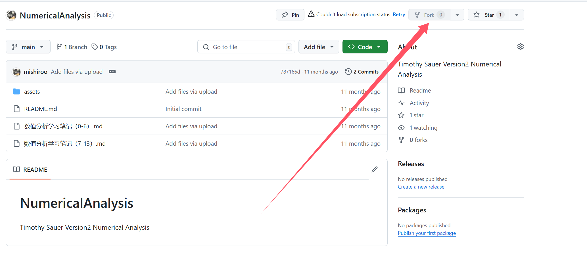
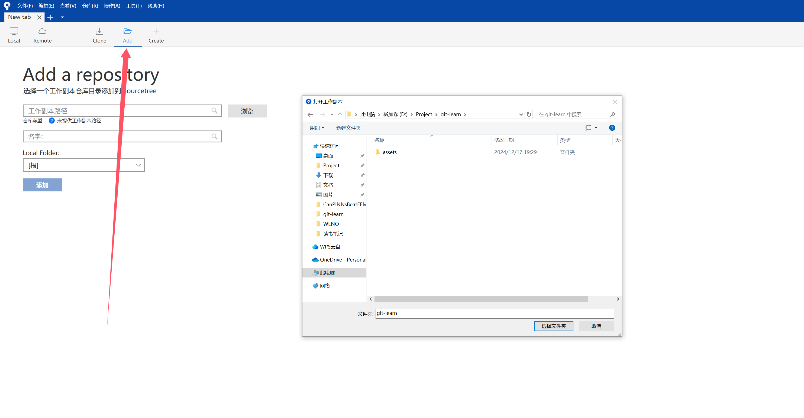
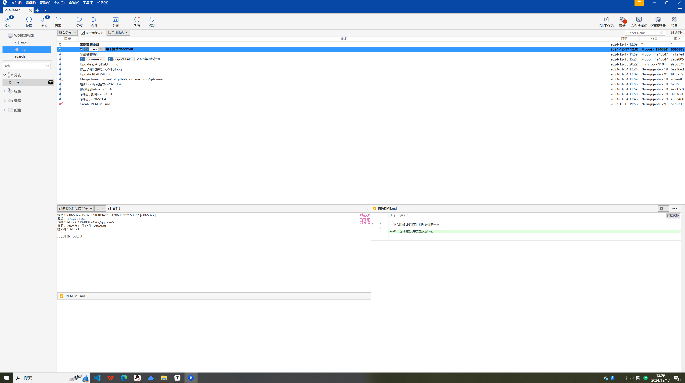
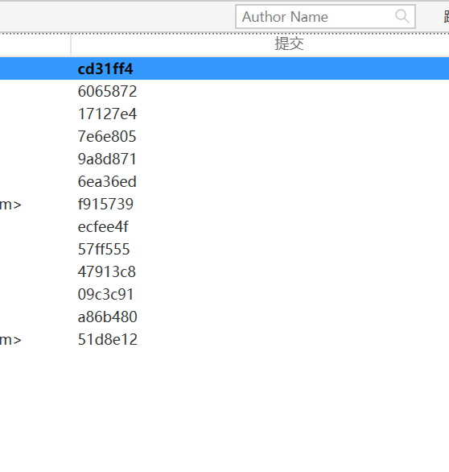

Reference: [菜鸟教程](https://www.runoob.com/git/git-basic-operations.html) &《跟Wakaba酱一起学Git使用》

> Git每一次提交都要设置注释
>
> git会帮我们记录who what when, 但无法记录why, 养成写清楚注释的好习惯, 便于代码回滚


**连接超时！**

在git bash输入

```
git config --global --unset http.proxy 
git config --global --unset https.proxy
```

参考: [完美解决 git 报错 “fatal: unable to access ‘https://github.com/.../.git‘: Recv failure Connection was rese-CSDN博客](https://blog.csdn.net/qq_43546721/article/details/139506583)


版本管理系统主要分为两类: **集中式, 分散式**.

**集中式**的特点是只有一个仓库供大家使用，所有的操作必须在与网络连接的条件下使用。

**分散式**的特点是开发者在自己的电脑上有各自的仓库，在适当的时刻同步到服务器上, 即使没网也能在自己的电脑看到历史记录


# 跟Wakaba酱一起学Git使用

## 你需要知道的小知识

### **Git 中 常常见到origin 为什么使用这个词语?**

[(9 封私信 / 80 条消息) Git 里面的 origin 到底代表啥意思? - 知乎 (zhihu.com)](https://www.zhihu.com/question/27712995)

这个名字没有特别的意思，事实上完全可以使用阿猫阿狗进行替换。

和python中的self地位类似，大家约定俗成使用这个代表远端仓库默认名字


### **为什么不使用master这个名字了？**

主要因为master有主人的意思，会给人不好的印象 所以2020年10月把master换成main作为默认分支的名字


### **在哪里托管代码？**

在github/Bitbucket上可以创建远程仓库，本文在github上托管代码:gem:

进行github上的仓库主要分public/private两种类型，private通常会限制协助开发者数量最多为3人(不付费的情况).


### 分支是什么？

> 官方解释: 指向提交对象的可变指针


## Github

我们通常将代码上传的地方.

在这里fork别人的代码，准确含义是复制他人公开的远程仓库到自己的账号




## SourceTree

官网搜索即可免费下载[Sourcetree | Free Git GUI for Mac and Windows](https://www.sourcetreeapp.com/)

图形化界面 非常简单易懂

### ==**添加仓库和创建仓库**==

注意这里是添加仓库，仓库需要有git文件进行管理...

> 如果之前用的GitBash进行代码管理，又添加了一些新文件，SourceTree会无法add这些文件, 原因解释[SourceTree识别不了新添加的文件夹 ](https://blog.csdn.net/qq_37478078/article/details/89381809?spm=1001.2101.3001.6661.1&utm_medium=distribute.pc_relevant_t0.none-task-blog-2~default~BlogCommendFromBaidu~PaidSort-1-89381809-blog-87818783.235^v43^pc_blog_bottom_relevance_base5&depth_1-utm_source=distribute.pc_relevant_t0.none-task-blog-2~default~BlogCommendFromBaidu~PaidSort-1-89381809-blog-87818783.235^v43^pc_blog_bottom_relevance_base5&utm_relevant_index=1)

如果你的项目处于新建文件夹阶段，请选择add右边的Create, 哪怕你拥有一定的代码，但没有git文件，也不能称之为一个仓库，所以还是需要选择`创建仓库`.

管理代码时，为避免奇怪的bug, 请只使用一套git管理工具, 不要混用！



branch显示




### 重要快捷键整理

```
f5: 刷新页面
alt+shift+c: 提交代码
```


### checkout

执行这个命令，让操作目录的文件变成指定时刻的文件。

即使已经checkout到过去的提交，还是可以回到最新的提交



每次提交都会分配由字母和数字组成的字符串commit id, 这是根据内容生成的哈希值（确保每次提交的唯一性）


### clone

把远程仓库下载到本地.


### merge

合并分支。

使用场景：

发布分支: main

开发者拉取debug分支修复bug，修好了再merge到main分支


例子:

```
print("Hello World from main branch")  # main branch
print("Hello World from dev branch")  # dev branch
```


合并过程：在master分支上，右键点击想要合并的分支，点击合并`dev`至当前的分支


### push

提交我们的代码，点击推送，设置好我们的仓库地址即可~


## 命令行交互

```
git add README.md  # 把文件添加到暂存区 可传入目录/文件 
# git add .  # 传入所有文件
```


git的运行结构


### git的创建

```
git init  # 创建该文件夹为一个git仓库
git commit -m "这是提交信息"  # Windows用的是双引号 linux用的单引号
# commit 最好不要传空的
git commit  # 进入vim 可以写的更多

```


### 正确的提交过程

```
git init                           //初始化仓库
git add .(文件name)                //添加文件到本地 
git commit -m “first commit”      //添加文件描述信息

git remote add origin  远程仓库地址 //链接远程仓库 
git remote set-url origin xxxxx.git //修改远程仓库地址

git pull origin main           // 把本地仓库的变化连接到远程仓库main分支
git push -u origin main        //把本地仓库的文件推送到远程仓库main分支
```

==.gitignore==:

比如忽略a/b下的子文件

应写入：**a/b/**,而不是a/b


pull字如其名是把网上的代码拔下来到自己本地

push字面意思是推，把自己写好的代码推到github上


### 一些重要的命令

```
git branch  # 查看本地分, *号标记当前所在分支
git branch -d (branchName)  # 删除分支
git branch -m master main  # 把名为master的分支改为main(只修改了名字)

git remote -v  # 查询远端仓库的地址

git status  # 查询文件状态

# 删除已经add的文件
git rm --cached "文件路径"  # 只删除缓存，不会物理删除文件
git rm --f "文件路径"  # 物理上也把文件删除了


```


### 常见bug修复

注意检查自己所在的分支是不是搞混main和master 可能会有超出预期的错误


提交时，注意不要让自己的版本落后于远端版本 所以需要先pull远端修改再push你的修改内容
